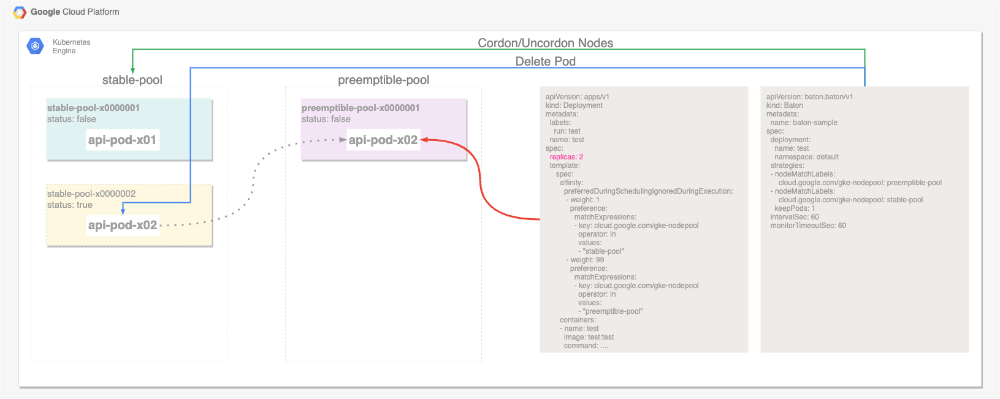

# baton
Re-Schedule pod to Node by Batons's strategy.

# Example
To use Baton, prepare yaml as below.
```yaml
apiVersion: baton.baton/v1
kind: Baton
metadata:
  name: baton
spec:
  deployment:
    name: nginx
    namespace: default
  strategies:
  - nodeMatchLabels:
      cloud.google.com/gke-nodepool: preemptible-pool
  - nodeMatchLabels:
      cloud.google.com/gke-nodepool: stable-pool
    keepPods: 1
  intervalSec: 60
  monitorTimeoutSec: 60
---
apiVersion: apps/v1
kind: Deployment
metadata:
  name: nginx
  labels:
    run: nginx
spec:
  replicas: 2
  progressDeadlineSeconds: 600
  revisionHistoryLimit: 10
  selector:
    matchLabels:
      run: nginx
  strategy:
    rollingUpdate:
      maxSurge: 1
      maxUnavailable: 0
    type: RollingUpdate
  template:
    metadata:
      labels:
        run: nginx
    spec:
      affinity:
        nodeAffinity:
          requiredDuringSchedulingIgnoredDuringExecution:
            nodeSelectorTerms:
            - matchExpressions:
              - key: cloud.google.com/gke-nodepool
                operator: In
                values:
                - "preemptible-pool"
                - "stable-pool"
          preferredDuringSchedulingIgnoredDuringExecution:
          - weight: 1
            preference:
              matchExpressions:
              - key: cloud.google.com/gke-nodepool
                operator: In
                values:
                - "stable-pool"
          - weight: 99
            preference:
              matchExpressions:
              - key: cloud.google.com/gke-nodepool
                operator: In
                values:
                - "preemptible-pool"
      containers:
      - name: nginx
        image: nginx
        imagePullPolicy: Always
        resources:
      dnsPolicy: ClusterFirst
      restartPolicy: Always
      schedulerName: default-scheduler
      securityContext: {}
      terminationGracePeriodSeconds: 20 # TODO: Make sure all requests are responsed
```

The baton will coordinate the scheduling to the node as shown below.
If the pod is less than the amount described in the strategy.


If there are more pods than the amount described in the strategy

